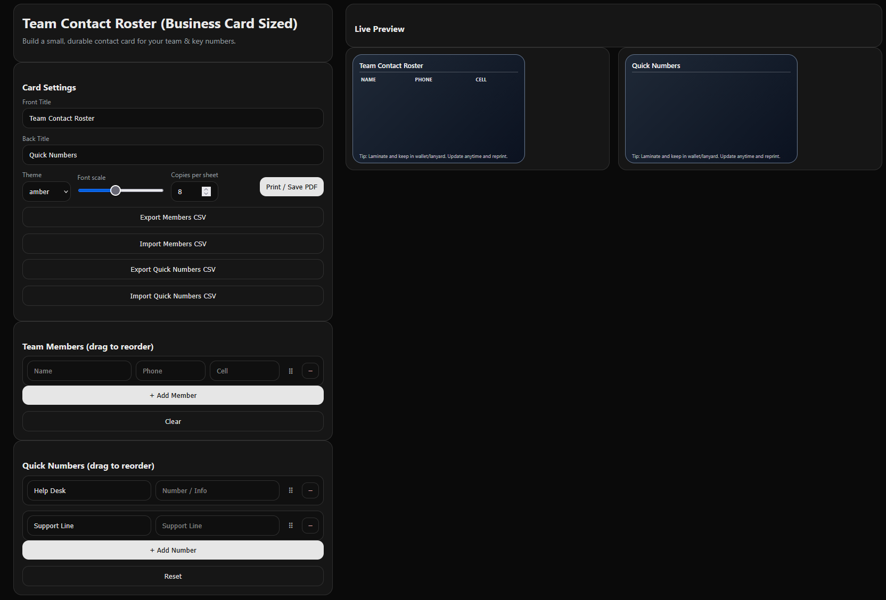

# Team Contact Roster (Business Card Sized)

Create wallet‑ready, business‑card sized contact cards for your team — with **drag‑to‑reorder**, **CSV import/export**, **themes**, and **true 85.6 × 54 mm** output for laminating.

> Two ways to use:
> 1) **Browser HTML (offline)** — double‑click `team-contact-roster-offline.html` (no install).  
> 2) **Offline Desktop App** — Electron project you can build into a portable `.exe`.

---

## 🖼️ Screenshot (Dark Theme)


> Tip: If your repo supports light/dark mode previews, you can add a light‑theme screenshot next to it, e.g. `assets/screenshot-light.png`, and show both or use HTML `<picture>` to switch automatically.

---

## ✨ What’s new in v1.3.3
- **No tip on print/PDF** — preview-only tip is hidden from print/PDF.
- Keeps v1.3.2 improvements: print‑only sheets, up to **16 rows** on the front, **2‑column** back layout, and **Quick Numbers CSV** import/export.

---

## Features (highlights)
- **True CR80 size** (85.6 × 54 mm / 3.375″ × 2.125″).
- **Front:** Team roster (`Name`,`Phone`,`Cell`) — up to **16 rows**.
- **Back:** Editable title + cleaner 2‑column layout (Label / Value).
- **Drag to reorder** (members + quick numbers).
- **CSV import/export** for both sections:
  - Members: `Name,Phone,Cell`
  - Quick Numbers: `Label,Value`
- **Persistence** (`localStorage`), **Themes**, **Font scaling**, **Copies per sheet**.
- **Print‑only sheets**: Editor UI and tip are hidden; only tiled Front (page 1) & Back (page 2) render.

---

## Quick Steps to Print Two‑Sided (Browser)

1. Click **Print / Save PDF** in the app.  
2. In the browser’s print dialog, set:
   - **Two‑sided / Duplex:** **On**
   - **Flip on:** **Long edge** (try **Short edge** only if backs are upside‑down)
   - **Scale / Zoom:** **100%** (don’t use “Fit to page”)
   - **Margins:** **Default** / **Normal**
3. Print. **Page 1 = Front tiles**, **Page 2 = Back tiles**. Your printer will place them on opposite sides of the same sheet.

**Manual duplex (for single‑sided printers):**
- Print **page 1 only** (fronts). Reinsert the paper as your printer expects, then print **page 2 only** (backs).
- If the backs are upside‑down, rotate the stack 180° before printing page 2.
- If left/right alignment is off, try flipping **on short edge** or reinserting the stack flipped over.

**Tips:**
- Keep **Scale = 100%** on both passes.
- Disable any driver “borderless,” “shrink/expand,” or “fit to page” options.

---

## Repo Layout
```
/browser-offline/
  team-contact-roster-offline.html   # single-file offline HTML

/electron-src/
  index.html           # offline UI (no CDNs)
  app.css
  app.js               # vanilla JS: drag, persistence, CSV, print, etc.
  main.js              # Electron main
  package.json
  build-win.ps1        # helper script for Windows

/assets/
  screenshot.png
```

> Yes: the **offline HTML is one file**.  
> Yes: the **.exe source** is multiple files (Electron project).

---

## 🚀 Quick Start (Browser HTML)
1. Open **`/browser-offline/team-contact-roster-offline.html`** in Chrome/Edge/Firefox.
2. Enter members & quick numbers; drag to order.
3. Change **Back Title** — the section header updates automatically.
4. Click **Print / Save PDF** (see **Quick Steps** above).

---

## 🖥️ Building the Portable .exe on Windows

### 0) Download the Electron source
Unzip the `electron-src` folder from the release or this repo.

### 1) Install Node.js (gets you `npm`)
- Download the **LTS** installer from https://nodejs.org and run it.
- Keep the **“Add to PATH”** option checked.
- **Close and reopen PowerShell** so the PATH refreshes.

Verify:
```powershell
node -v
npm -v
```
You should see versions (e.g., `v20.x.x` and `10.x.x`).

> **Alternative (no admin / multiple versions):** Install **NVM for Windows** (https://github.com/coreybutler/nvm-windows), then:
> ```powershell
> nvm install lts
> nvm use lts
> node -v
> npm -v
> ```

### 2) Install dependencies and build
Open **PowerShell** in the `electron-src` folder:
```powershell
npm install
npm start      # run it in a window (optional)
npm run pack   # builds a portable .exe in .\dist```
Result:
```
dist\TeamContactRoster-win32-x64\TeamContactRoster.exe
```

### 3) Optional: run the helper script
If PowerShell scripts are blocked:
```powershell
Set-ExecutionPolicy -Scope CurrentUser RemoteSigned
.uild-win.ps1 -Pack
```

### If `npm` is “not recognized”
- Ensure Node.js was installed **and** you opened a **new** PowerShell after install.
- Check your **PATH** contains `C:\Program Files
odejs\`:
  - Win+R → `rundll32 sysdm.cpl,EditEnvironmentVariables`
  - System variables → **Path** → **Edit** → **New** → add:
    ```
    C:\Program Files
odejs    ```
  - OK everything, reopen PowerShell, and try `node -v`, `npm -v` again.

---

## 📄 CSV Examples
**Members:**
```csv
Name,Phone,Cell
Jane Smith,555-123-4567,555-987-6543
John Doe,555-000-1111,555-222-3333
```
**Quick Numbers:**
```csv
Label,Value
Help Desk,555-100-2000
Support Line,555-300-4000
On-Call Escalation,555-777-8888
```

**Tips**
- Quoted fields are supported: `"Last, First","(555) 123-4567","555-222-3333"`
- Import replaces the current list for that section (members or quick numbers).

---

## 🔍 Troubleshooting
- **Editor UI shows up in printed PDF** → Use v1.3.3+ (print‑only sheets + tip hidden).
- **Back page looks misaligned** → v1.3.2+ uses a 2‑column table for alignment.
- **Not all members appear on the front** → Reduce **Font Scale** or ensure v1.3.2+ (tighter typography). Max ~16 rows.
- **CSV import doesn’t load everything** → Verify headers (`Name,Phone,Cell` or `Label,Value`). Quoted fields are supported.
- **Data didn’t save** → Private/Incognito disables persistent storage. Use a normal window.

---

## Version History
- **v1.3.3** — Hide tip on print/PDF; retain v1.3.2 improvements.
- **v1.3.2** — Print‑only sheets; up to 16 rows; 2‑column back; Quick Numbers CSV import/export.
- **v1.3.1** — Rename; centered Import button; dynamic back header.
- **v1.3** — Import button match/center; terminology cleanup.
- **v1.2** — Persistence, Members CSV, editable back title, wider UI, drag‑to‑reorder.
- **v1.0** — Initial release.
