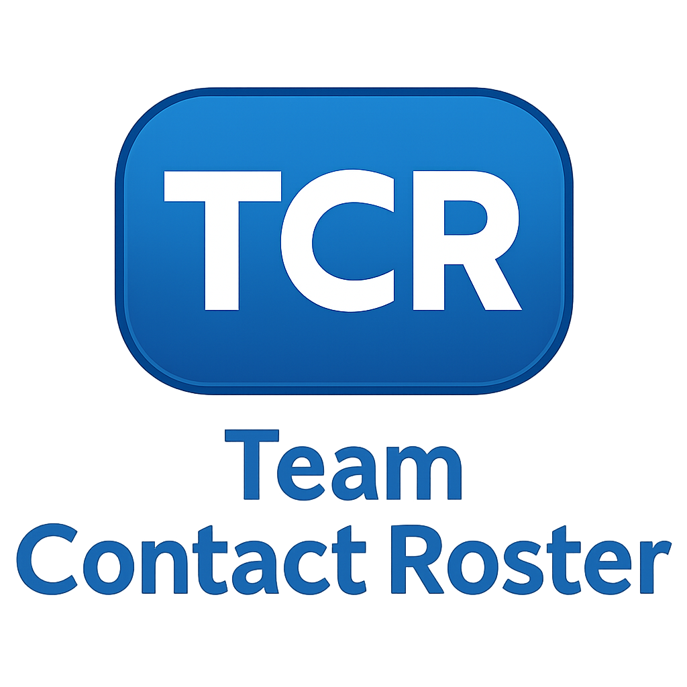
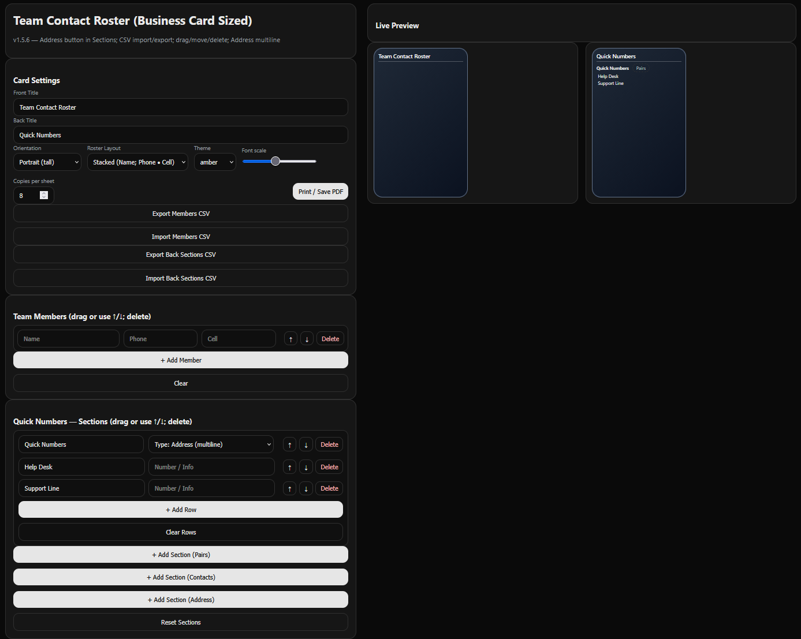

<p align="center">
  
</p>

<p align="center">
  <a href="https://to3knee.github.io/team-roster/app/">
    ▶️ <b>Launch the app</b>
  </a>
</p>

<h1 align="center">Team Contact Roster (Business Card Sized)</h1>

<p align="center">
  <a href="https://github.com/To3Knee/team-roster/releases">
    
  </a>

  <a href="https://to3knee.github.io/team-roster/app/">
    
  </a>

  <a href="https://github.com/To3Knee/team-roster">
    
  </a>

  <a href="https://github.com/To3Knee/team-roster/blob/main/LICENSE">
    
  </a>

  
</p>


Create wallet‑ready, business‑card sized contact cards for your team — with **drag‑to‑reorder**, **CSV import/export**, **themes**, and **true 85.6 × 54 mm** output for laminating.

> Two ways to use:
> 1) **Browser HTML (offline)** — double‑click `team-contact-roster-offline.html` (no install).  
> 2) **Offline Desktop App** — Electron project you can build into a portable `.exe`.

---

## 🖼️ Screenshot (Dark Theme)


---

## ✨ What’s new in v1.5.6
- **Address** section button is back (multiline, auto-wrap).
- **Contacts** section on the back (Name / Phone / Cell rows).
- **CSV import/export for back sections** (Pairs / Contacts / Address).
- **External JS** (no inline scripts) so local HTML works in locked-down browsers.
- **Delete** everywhere + **move** via **drag** or **↑/↓** for members, sections, and items.
- **Portrait / Landscape** and **Stacked / Table** layouts for the front.
- **Duplex-friendly print**: fronts tile on page 1; backs tile on page 2.

> Portrait: use **Flip on long edge**.  
> Landscape: use **Flip on short edge**.

---

## ✨ What’s new in v1.3.3
- **No tip on print/PDF** — preview-only tip is hidden from print/PDF.
- Keeps v1.3.2 improvements: print‑only sheets, up to **16 rows** on the front, **2‑column** back layout, and **Quick Numbers CSV** import/export.

# 📦 Downloads

- **Offline App (Browser)** — single folder inside zip  
  `team-contact-roster-offline-v1.5.6.zip` → open `Browser-Offline/index.html`

- **Electron Source (build a portable .exe / app)**  
  `team-contact-roster-electron-src-v1.5.6.zip`

---

## Features
- **Front (Team Roster)**  
  - **Table** (Name / Phone / Cell) or **Stacked** (Name; Phone • Cell)  
  - **Portrait** or **Landscape**, adjustable **Font scale**, **Theme**
- **Back (Quick Numbers & More)** — add, rename, and reorder multiple **Sections**:  
  - **Pairs** (Label / Value) — e.g., Help Desk, Support Line  
  - **Contacts** (Name / Phone / Cell) — for extra teams or vendors  
  - **Address** (multiline block) — building/site address (auto‑wrap)  
- **Reorder & edit controls everywhere**: drag, **↑/↓**, and **Delete**
- **CSV import/export**  
  - Members CSV (front)  
  - Back Sections CSV (Pairs / Contacts / Address)  
- **Local persistence** via `localStorage` (survives refresh)  
- **Print‑ready layout** designed for easy cutting & laminating

---

## Quick Steps to Print Two‑Sided (Browser)

1. Open the app (offline HTML or GitHub Pages).  
2. Enter your **Members** and **Back Sections** (Pairs / Contacts / Address).  
3. Choose **Orientation** (Portrait/Landscape), **Roster Layout**, and **Font scale**.  
4. Click **Print / Save PDF**.  
5. In the print dialog:  
   - **Two‑sided / Duplex:** On  
   - **Flip on:** **Long edge** (Portrait) or **Short edge** (Landscape)  
   - **Scale / Zoom:** 100% (Actual size)  
   - **Margins:** Default/Normal  
6. Print, cut, and laminate.

**Manual duplex (single‑sided printers):**  
Print **page 1 only** (fronts). Reinsert the paper as your printer expects, then print **page 2 only** (backs). If the backs are upside‑down, rotate the stack 180° before printing page 2.

```
## Electron: build a portable desktop app (.exe)

1) Install **Node.js** (LTS) from https://nodejs.org.  
   Reopen PowerShell/Terminal after install so `npm` is available.

2) Unzip `team-contact-roster-electron-src-v1.5.6.zip`:
```
electron-src/
  package.json
  main.js
  preload.js
  index.html
  app.js
```

3) Build on Windows:
```powershell
cd electron-src
npm install
npm start         # run dev app
npm run pack:win  # builds a portable .exe in dist/
```

**“npm is not recognized”:** Reopen your shell after installing Node.js (or log out/in); verify `node -v` and `npm -v`.

---

## CSV Examples

### Members CSV (Front)
```csv
Name,Phone,Cell
Alice Example,555-111-2222,555-333-4444
Bob Example,555-222-3333,
```

### Back Sections CSV (Pairs / Contacts / Address)

Use headers: `Section,Type,Label,Value,Name,Phone,Cell`

**Pairs (Label/Value)**
```csv
Section,Type,Label,Value,Name,Phone,Cell
Quick Numbers,pairs,Help Desk,555-1212,,,
Quick Numbers,pairs,Support Line,555-3434,,,
```

**Contacts (Name/Phone/Cell)**
```csv
Section,Type,Label,Value,Name,Phone,Cell
Management,contacts,,,,Dana Example,555-9898,555-1212
Management,contacts,,,,Alex Example,555-6767,
```

**Address (multiline in Value)**
```csv
Section,Type,Label,Value,Name,Phone,Cell
Site Address,address,,123 Main St\nSuite 400\nBaltimore, MD 21201,,,
```

> Importing **replaces** the current Back Sections list with what’s in the CSV.

---

## Troubleshooting

- **Only the header shows when opened locally:**  
  This build uses **external JS** to avoid strict `file://` blocking; if your environment blocks *all* local JS, run the **Electron app** or host on **GitHub Pages**.

- **Duplex misalignment:**  
  Portrait → **Flip on Long Edge**. Landscape → **Flip on Short Edge**. Keep **Scale = 100%**.

- **Text too tight / too large:**  
  Lower **Font scale** or switch roster layout (**Table** ↔ **Stacked**).

- **CSV import looks wrong:**  
  Check headers; for **Address**, put the entire multiline address in **Value** with `\n` separators.
  
---
  
## ⭐ Star Us
If you find this project useful, please give us a ⭐ on GitHub! Your support is greatly appreciated.

---

## Version History
- **v1.5.6** — Address section button restored; Back Contacts; CSV import/export for back sections; external JS; drag/move/delete everywhere; duplex front/back pages.
- **v1.5.x** — Portrait/Landscape; Stacked/Table; theme & font scale; duplex refinements.
- **v1.3.3** — Hide tip on print/PDF; retain v1.3.2 improvements.
- **v1.3.2** — Print‑only sheets; up to 16 rows; 2‑column back; Quick Numbers CSV import/export.
- **v1.3.1** — Rename; centered Import button; dynamic back header.
- **v1.3** — Import button match/center; terminology cleanup.
- **v1.2** — Persistence, Members CSV, editable back title, wider UI, drag‑to‑reorder.
- **v1.0** — Initial release.


## 📜 License

Licensed under the [High Five License](LICENSE) 🙌  
Give a high five to download, and a **super high, LOUD high five** to use **Team Contact Roster**! 🎉 See the [LICENSE](LICENSE) file for the full, fist-bumping details!

<p align="center">
  <em>Built with 💖 for GitHub heroes tackling Team Contact Information challenges!</em><br>
  <a href="https://github.com/To3Knee/team-roster/stargazers"></a>
</p>
